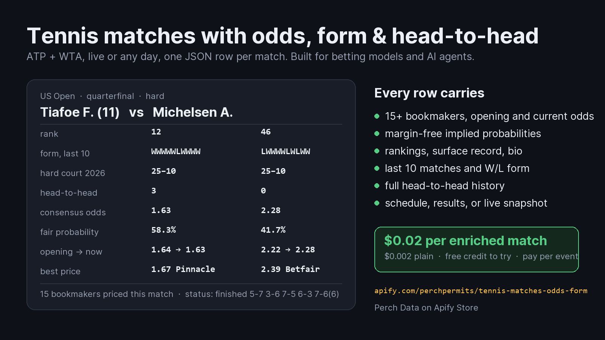

# Perch Data actors

Source for the Apify Store actors published by [Perch Data](https://apify.com/perchpermits). All four are Python; the Apify SDK is only used by each actor's `src/main.py`, so every actor also runs from the command line with no Apify account.

| Actor | Store page | What it does |
|---|---|---|
| [kalshi-weather](kalshi-weather/) | [apify.com/perchpermits/kalshi-weather-markets-nws](https://apify.com/perchpermits/kalshi-weather-markets-nws) | Every Kalshi daily high and low temperature market, one JSON row per city-day ladder with every strike and its implied probability, joined to the NWS station that settles it: observations so far today, the daily and hourly forecast, the official climate report, and which strike each lands on. 24 US cities. $0.02 per enriched ladder. |
| [tennis-matches](tennis-matches/) | [apify.com/perchpermits/tennis-matches-odds-form](https://apify.com/perchpermits/tennis-matches-odds-form) | ATP and WTA matches, one JSON row each: schedule, results, or live snapshot, with 15+ bookmakers' opening and current odds, margin-free implied probabilities, each player's last 10 matches and surface record, rankings, and the full head-to-head. $0.02 per enriched match. |
| [nashville-permits](nashville-permits/) | [apify.com/perchpermits/nashville-building-permits](https://apify.com/perchpermits/nashville-building-permits) | Nashville / Davidson County TN permits and applications joined to the licensed contractor, owner, outstanding sub-trade permits, and inspection stage. 22 scope presets. Contractor ranking. |
| [kitchen-plan](kitchen-plan/) | [apify.com/perchpermits/kitchen-floor-plan-takeoff](https://apify.com/perchpermits/kitchen-floor-plan-takeoff) | JSON room spec in; dimensioned floor plan (SVG), cabinet takeoff (CSV), and quote totals out. |

Each folder has its own README, the same one shown on the store page, with every input and output field documented.

## Tennis: what one row carries



Every number on the card is from the real row for that match. Other tennis actors on the store sell one piece each (scores, or one player's history, or results without odds); this one joins them so an agent does not need four actors and a merge step.

## Run locally

```bash
cd kalshi-weather
python -m venv .venv && .venv/Scripts/pip install -r requirements.txt   # or .venv/bin/pip
python -m src.kalshi_weather.cli --stations NYC MDW --kind high
python -m src.kalshi_weather.cli --status settled --date-from 2026-09-08 --no-enrich
python -m unittest discover -s tests -t .
```

```bash
cd tennis-matches
python -m venv .venv && .venv/Scripts/pip install -r requirements.txt   # or .venv/bin/pip
python -m src.tennis_matches.cli schedule --tour atp --max 5 --enrich
python -m src.tennis_matches.cli results --date 2026-09-08 --tournament "US Open"
python -m unittest discover -s tests
```

```bash
cd nashville-permits
python -m venv .venv && .venv/Scripts/pip install -r requirements.txt   # or .venv/bin/pip
python -m src.nashville_permits.cli search --scope kitchen --days 30 --max 10 --enrich
python -m unittest tests.test_offline
```

```bash
cd kitchen-plan
python -m src.kitchen_plan.cli tests/fixtures/kitchen_example.json --out out/example
python -m unittest tests.test_kitchen_plan
```

## Data sources and policy

- **Kalshi weather:** Kalshi's public trade API (unauthenticated read endpoints, no key) and api.weather.gov, both official JSON APIs, 0.25 seconds between requests, an identifying User-Agent as NWS asks. Prices are Kalshi's listed quotes at fetch time, for information only; Kalshi is a regulated US exchange, check your eligibility before trading.
- **Tennis:** TennisExplorer public pages, no login, on paths its robots.txt allows. One session, an identifying User-Agent, a 0.4 second delay between requests, retries on 429 and 5xx. Odds are the bookmakers' listed prices at the time the source recorded them, for information only; check your local law before acting on them.
- **Permits:** Metro Nashville Open Data (ArcGIS feature services for permits issued and permit applications) and the Metro ePermits public case API. Building permits are public records under Tennessee's Public Records Act (T.C.A. 10-7-503). One ePermits request per second, an identifying User-Agent, a shared cache.
- Every actor carries a drift guard: if a source changes its layout or a field name, the run fails loudly and charges nothing rather than returning nulls at full price.
- No private sites are scraped and no field is guessed. Missing values are `null`.

## Monitoring

Each actor has a canary script under `scripts/` that runs a fixed small workload against the live source and returns healthy, degraded, or broken. They run three times a day.

## License

MIT for the code in this repository. Data returned by the actors is public record or publicly listed information and carries no license from Perch Data.
